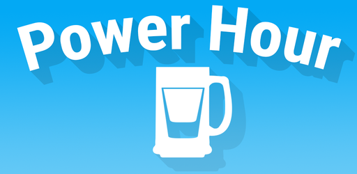
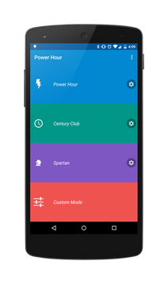
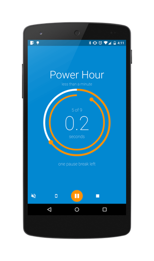
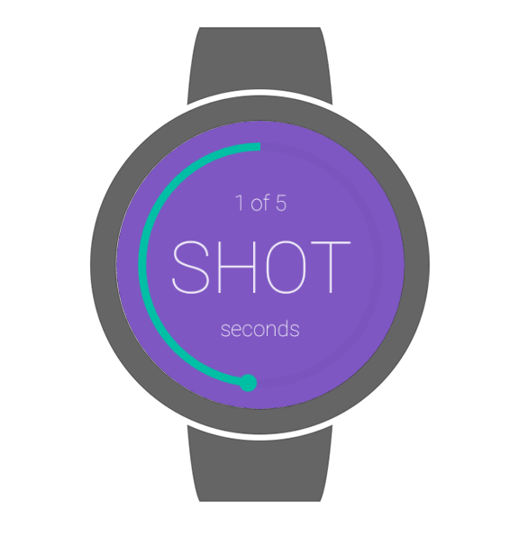

Master [](https://ci.hoogit.ca/job/PowerHour.master/)

Develop [](https://ci.hoogit.ca/job/PowerHour.develop/)


An application to aid in the playing of a classic drinking game called Power Hour, or Century club.
With the goal being consume a shot of beer every minute for an hour, or one hundred minutes.

</img>
</img>
</img>

##Get It
<a href="https://play.google.com/store/apps/details?id=ca.hoogit.powerhour&utm_source=global_co&utm_medium=prtnr&utm_content=Mar2515&utm_campaign=PartBadge&pcampaignid=MKT-AC-global-none-all-co-pr-py-PartBadges-Oct1515-1"></a>

Or grab the apk [here](https://ci.hoogit.ca/job/PowerHour.master/), or better yet clone and build yourself.

##Changelog
```
Version 2.0
- BIG update
- Added Android Wear support
- Permission Changes
  - None? I don't think Wear requires anymore permissions
- Bug fixes
  - Incorrect time remaining is now displayed properly
  - Fix centering of some items in tablet mode
  - Fix some fatal crashes that occurred during configuring game
  - Rate app button actually opens Play Store properly
- Tweaked about page
Version 1.1
 - Initial release to play store
```

##Features
- Beautiful Material Design elements
- Completely customizable game modes
- Use of foreground services and wake locks to keep the game active with the screen off
- Change background and accent colors
- Choose a notification sound or record your own
- Android Wear support!
- **FREE & AD FREE**

##TODO
- Before & After shots, stitched together at end of game
- Sharing said photos to facebook/instagram/tweeeeter etc.
- Add camera button to game controls, take picture any time you want? Stitch together at end
- Add music playlist, options:
  - Play 60 seconds of random song, and switch songs when its shot time
  - Just choose from a list of music to play in the background
- Proper settings menu
  - Enable/disable wear feature
- Update TargetSDK to Marshmallow aka implement new permissions "feature"

##Android Wear
**It just Works™**

In theory as long as a Wear device is paired it should receive updates and information.
I have tried my best to make it work with many Wear devices, but I only have the emulator to work with.
If there is anyone out there using that feature and something looks wrong let me know!

##Permissions Breakdown
- Record Audio - For recording your own sound to be played at the end of each round
- Vibrate - Used with the audio to alert you the round has finished
- Internet - Used for the crash reporting analytics
- Wake Lock - So the countdown will continue to be active if the screen is turned off

##Libraries used
```groovy
compile 'de.psdev.licensesdialog:licensesdialog:1.7.0'
compile 'com.jakewharton:butterknife:7.0.1'
compile 'com.squareup:otto:1.3.8'
compile 'com.github.paolorotolo:appintro:3.4.0'
compile 'com.crashlytics.sdk.android:crashlytics:2.4.0@aar'
compile 'com.daimajia.easing:library:1.0.1@aar'
compile 'com.daimajia.androidanimations:library:1.1.3@aar'
compile 'com.github.markushi:circlebutton:1.1'
compile 'info.hoang8f:fbutton:1.0.5'
compile 'com.github.afollestad.material-dialogs:core:0.8.5.6@aar'

// personal repo
compile 'ca.hoogit:circularprogressbar:2.0.1'
compile 'ca.hoogit:MaterialDesign:1.0.2'
compile 'ca.hoogit:fabbutton:1.2.0'
compile 'ca.hoogit:soundchooser:1.1.0'
compile 'com.nineoldandroids:library:2.4.0'
```

##License

Power Hour
Copyright (C) 2015  Jordon de Hoog

This program is free software; you can redistribute it and/or modify
it under the terms of the GNU General Public License as published by
the Free Software Foundation; either version 2 of the License, or
(at your option) any later version.

This program is distributed in the hope that it will be useful,
but WITHOUT ANY WARRANTY; without even the implied warranty of
MERCHANTABILITY or FITNESS FOR A PARTICULAR PURPOSE.  See the
GNU General Public License for more details.

You should have received a copy of the GNU General Public License along
with this program; if not, write to the Free Software Foundation, Inc.,
51 Franklin Street, Fifth Floor, Boston, MA 02110-1301 USA.
