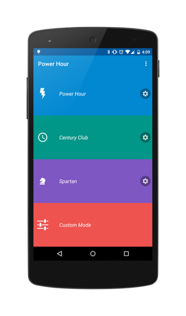

An application to aid in the playing of a classic drinking game called Power Hour, or Century club.
With the goal being consume a shot of beer every minute for an hour, or one hundred minutes.




##Changelog
```
Version 1.1
 - Initial release to play store
```
##Features
- Beautiful Material Design elements
- Completely customizable game modes
- Use of foreground services and wake locks to keep the game active with the screen off
- Change background and accent colors
- Choose a notification sound or record your own
- FREE & AD FREE

##Get It
[](https://play.google.com/store/apps/details?id=ca.hoogit.powerhour)

Or grab the apk [here](raw/powerhour.apk), or better yet download and build yourself.

##Permissions Breakdown
- Record Audio - For recording your own sound to be played at the end of each round
- Vibrate - Used with the audio to alert you the round has finished
- Internet - Used for the crash reporting analytics
- Wake Lock - So the countdown will continue to be active if the screen is turned off

##Libraries used
```groovy
compile 'de.psdev.licensesdialog:licensesdialog:1.7.0'
compile 'com.jakewharton:butterknife:7.0.1'
compile 'com.squareup:otto:1.3.8'
compile 'com.github.paolorotolo:appintro:3.1.0'
compile 'com.crashlytics.sdk.android:crashlytics:2.4.0@aar'
compile 'com.daimajia.easing:library:1.0.1@aar'
compile 'com.daimajia.androidanimations:library:1.1.3@aar'
compile 'com.github.markushi:circlebutton:1.1'
compile 'info.hoang8f:fbutton:1.0.5'
compile 'com.afollestad:material-dialogs:0.7.6.0'
// personal repo
compile 'ca.hoogit:circularprogressbar:2.0.1'
compile 'ca.hoogit:MaterialDesign:1.0.1'
compile 'ca.hoogit:fabbutton:1.2.0'
compile 'ca.hoogit:soundchooser:1.1.0'
compile 'com.nineoldandroids:library:2.4.0'
```

##License

Power Hour
Copyright (C) 2015  Jordon de Hoog

This program is free software; you can redistribute it and/or modify
it under the terms of the GNU General Public License as published by
the Free Software Foundation; either version 2 of the License, or
(at your option) any later version.

This program is distributed in the hope that it will be useful,
but WITHOUT ANY WARRANTY; without even the implied warranty of
MERCHANTABILITY or FITNESS FOR A PARTICULAR PURPOSE.  See the
GNU General Public License for more details.

You should have received a copy of the GNU General Public License along
with this program; if not, write to the Free Software Foundation, Inc.,
51 Franklin Street, Fifth Floor, Boston, MA 02110-1301 USA.
